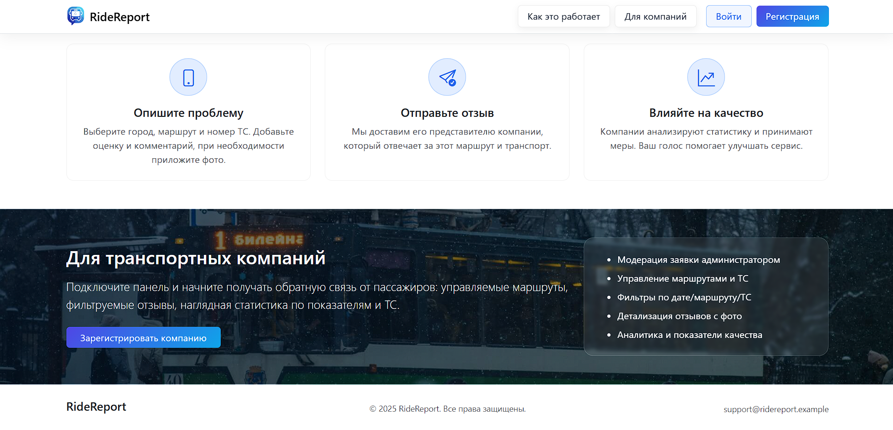
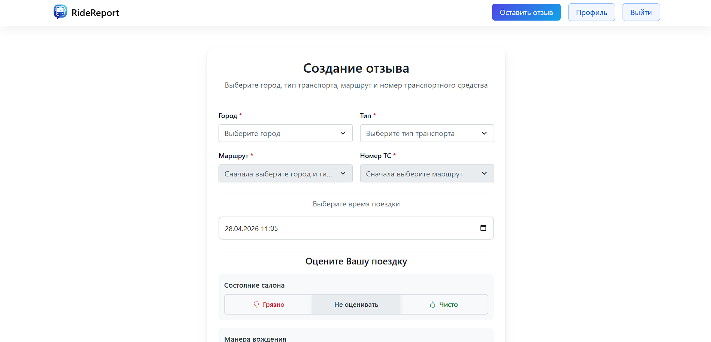
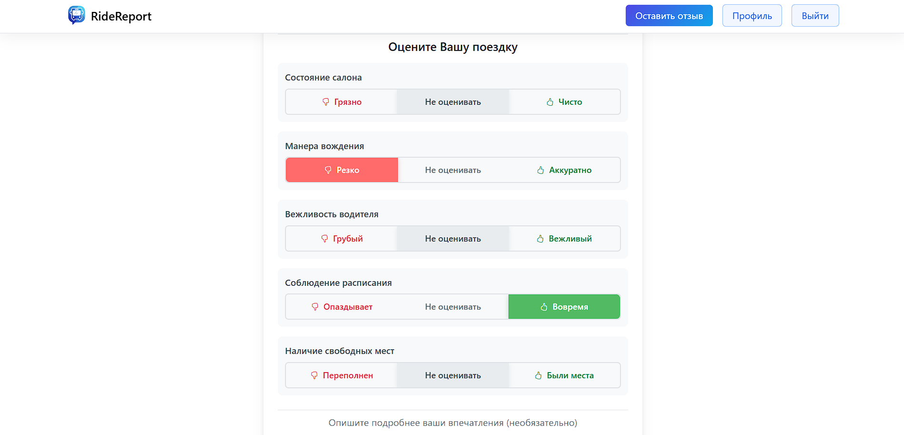
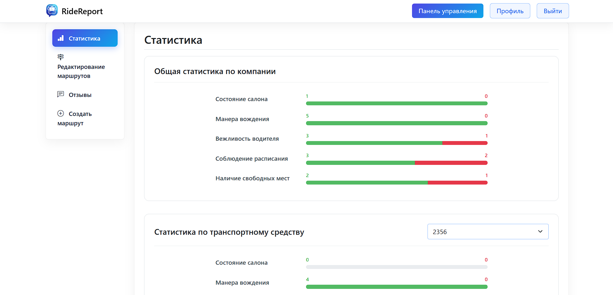
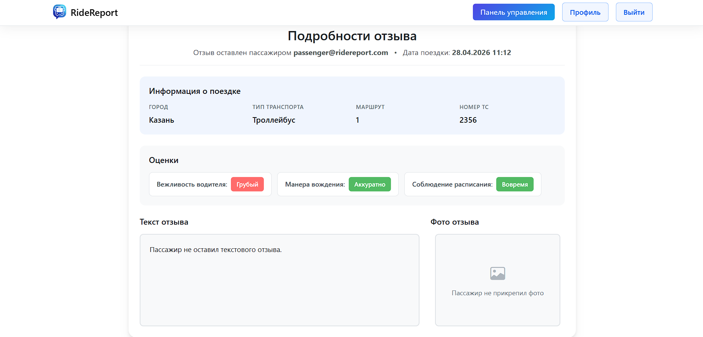
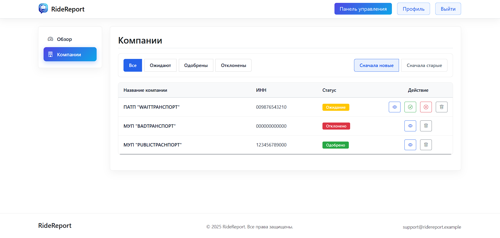

# RideReport

Веб-платформа для пассажиров общественного транспорта и транспортных компаний. Пассажиры оставляют отзывы о поездках; компании регистрируются на платформе, управляют маршрутами и парком, отслеживают обратную связь по своим услугам.

---

## Скриншоты

| | |
|---|---|
|  |  |
|  |  |
|  |  |
|  |  |

---

## Описание

RideReport объединяет две аудитории: пассажиров, которые хотят поделиться опытом после поездки, и транспортные компании, которым нужна структурированная обратная связь для контроля качества услуг. Платформа поддерживает полный цикл регистрации и модерации — компании проходят проверку администратором, прежде чем получить доступ к панели оператора.

---

## Функциональность

### Пассажир

- Регистрация и аутентификация по email и паролю
- Создание отзыва о поездке: выбор маршрута, указание номера ТС и времени поездки, произвольный текст, прикрепление фотографий

### Компания

- Подача заявки на регистрацию с прикреплением подтверждающих документов
- Доступ к панели оператора после одобрения заявки администратором
- Добавление и управление маршрутами и транспортными средствами
- Просмотр всех отзывов по услугам компании, детальный просмотр каждого отзыва
- Агрегированная статистика по транспортным средствам и маршрутам

### Администратор

- Рассмотрение входящих заявок на регистрацию компаний
- Одобрение или отклонение заявок, скачивание приложенных документов
- Управление статусами компаний через выделенную административную панель

---

## Стек технологий

| Слой | Технология |
|---|---|
| Язык | Java 23 |
| Веб-слой | Servlet API 4.0 |
| Шаблонизатор | Apache FreeMarker 2.3.34 |
| База данных | PostgreSQL |
| Доступ к БД | Raw JDBC, паттерн DAO |
| Хеширование паролей | jBCrypt |
| JSON / AJAX | Jackson Databind 2.17 |
| Хранение изображений | Cloudinary SDK 2.3 |
| Логирование | SLF4J + Logback |
| Сборка | Maven, WAR-пакет |
| Сервер | Apache Tomcat (или любой Servlet 4.0-совместимый контейнер) |

> Ряд UI-взаимодействий — динамические селекты маршрута и ТС, real-time валидация полей — реализован через AJAX: сервер отдаёт облегчённые JSON-эндпоинты, которые потребляет клиентский JS.

---

## Архитектура

Проект следует слоистой архитектуре без использования фреймворка:

```
servlets/     — обработка HTTP-запросов, разбита по ролям: /admin, /company, /passenger
services/     — бизнес-логика
dao/          — доступ к данным, raw JDBC
db/           — конфигурация пула соединений
entities/     — доменная модель
dto/          — объекты передачи данных между слоями
filters/      — аутентификация и ролевой контроль доступа
listeners/    — инициализация приложения (ServletContextListener)
config/       — загрузка внешней конфигурации
utils/        — общие утилиты
enums/        — определения ролей и статусов
exceptions/   — иерархия пользовательских исключений
```

Контроль доступа реализован на уровне фильтров. Три роли — `PASSENGER`, `COMPANY`, `ADMIN` — каждая маппится на своё пространство URL.

---

## Модель данных

- **User** — аккаунт пользователя с ролью и учётными данными
- **Company** — привязана к User, хранит статус одобрения
- **CompanyDocument** — файлы, приложенные при регистрации; хранятся на Cloudinary
- **Route** — принадлежит Company, определяется номером и типом транспорта
- **TransportMode** — вид транспорта: автобус, трамвай, троллейбус и др.
- **Vehicle** — идентифицируется бортовым номером, привязан к маршруту
- **Review** — написан пассажиром; ссылается на маршрут, номер ТС и время поездки
- **ReviewPhoto** — фотографии к отзыву, хранятся на Cloudinary
- **City** — географический справочник для маршрутов

---

## Конфигурация

Конфиденциальные данные не хранятся в репозитории. Скопируй шаблоны и заполни свои значения:

```bash
cp src/main/resources/database.properties.template src/main/resources/database.properties
cp src/main/resources/cloudinary.properties.template src/main/resources/cloudinary.properties
```

`database.properties`:
```properties
db.url=jdbc:postgresql://localhost:5432/ridereport
db.username=your_username
db.password=your_password
db.pool.size=10
```

`cloudinary.properties`:
```properties
cloudinary.cloud_name=your_cloud_name
cloudinary.api_key=your_api_key
cloudinary.api_secret=your_api_secret
```

---

## Запуск

**Требования:** JDK 23+, Maven 3.8+, PostgreSQL, Apache Tomcat 10+

```bash
git clone https://github.com/nkropinoff/RideReport.git
cd RideReport

# настрой конфигурацию (см. выше)

mvn clean package
# задеплой target/*.war на Tomcat
```

---

## Статус проекта

Разработан в рамках семестровой работы в ITIS КФУ. Кодовая база демонстрирует production-ориентированное Java-веб-приложение, написанное на Servlet API без фреймворков — с ручной реализацией жизненного цикла запросов, управления сессиями, ролевого контроля доступа и конфигурирования зависимостей.
