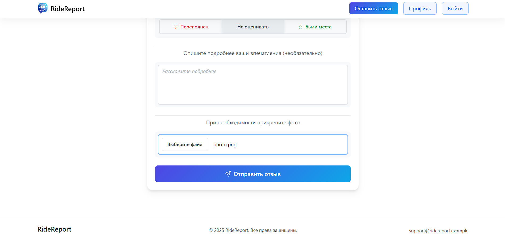

# RideReport

A web platform for public transport passengers and transit operators. Passengers can leave detailed reviews of their rides; companies can register on the platform, manage their routes and fleet, and track feedback analytics across their services.

---

## Screenshots

| | |
|---|---|
|  |  |
|  |  |
|  |  |
|  |  |

---

## Overview

RideReport bridges two audiences: everyday passengers who want to share their experience after a trip, and transport companies that need structured feedback to monitor service quality. The platform supports a full registration and moderation pipeline — companies go through an admin-reviewed approval process before gaining access to the operator panel.

---

## Features

### Passenger

- Register and authenticate via email and password
- Submit a ride review: select a route, specify the vehicle number and ride time, write a free-form comment, and attach photos

### Company

- Submit a registration request with supporting documents attached
- Access the operator panel after admin approval
- Add and manage routes and vehicles
- View all reviews linked to company services; inspect each review in detail
- Access aggregated statistics per vehicle and route

### Administrator

- Review incoming company registration requests
- Approve or reject applications with the ability to download submitted documents
- Manage company statuses through a dedicated admin panel

---

## Tech Stack

| Layer | Technology |
|---|---|
| Language | Java 23 |
| Web layer | Servlet API 4.0 |
| Template engine | Apache FreeMarker 2.3.34 |
| Database | PostgreSQL |
| DB access | Raw JDBC, DAO pattern |
| Password hashing | jBCrypt |
| JSON / AJAX | Jackson Databind 2.17 |
| Image storage | Cloudinary SDK 2.3 |
| Logging | SLF4J + Logback |
| Build | Maven, WAR packaging |
| Runtime | Apache Tomcat (or any Servlet 4.0 container) |

> Several UI interactions (route/vehicle selects, real-time input validation) are implemented via AJAX — the server exposes lightweight JSON endpoints consumed by vanilla JS on the client side.

---

## Architecture

The project follows a layered architecture without a framework:

```
servlets/     — request handling, organised by role: /admin, /company, /passenger
services/     — business logic
dao/          — data access, raw JDBC
db/           — connection pool configuration
entities/     — domain model
dto/          — data transfer objects
filters/      — authentication and role-based access control
listeners/    — application bootstrap (ServletContextListener)
config/       — external configuration loading
utils/        — shared helpers
enums/        — role and status definitions
exceptions/   — custom exception hierarchy
```

Access control is enforced at the filter level. Three roles exist — `PASSENGER`, `COMPANY`, `ADMIN` — each mapped to its own URL namespace.

---

## Data Model

- **User** — account with role and credentials
- **Company** — linked to a User, carries approval status
- **CompanyDocument** — files submitted during registration, stored on Cloudinary
- **Route** — belongs to a Company, defined by number and transport mode
- **TransportMode** — bus, tram, trolleybus, etc.
- **Vehicle** — identified by board number, linked to a Route
- **Review** — written by a passenger; references a Route, vehicle number, and ride timestamp
- **ReviewPhoto** — photos attached to a Review, stored on Cloudinary
- **City** — geographic reference for routes

---

## Configuration

Credentials are not committed to the repository. Copy the provided templates and fill in your values:

```bash
cp src/main/resources/database.properties.template src/main/resources/database.properties
cp src/main/resources/cloudinary.properties.template src/main/resources/cloudinary.properties
```

`database.properties`:
```properties
db.url=jdbc:postgresql://localhost:5432/ridereport
db.username=your_username
db.password=your_password
db.pool.size=10
```

`cloudinary.properties`:
```properties
cloudinary.cloud_name=your_cloud_name
cloudinary.api_key=your_api_key
cloudinary.api_secret=your_api_secret
```

---

## Getting Started

**Prerequisites:** JDK 23+, Maven 3.8+, PostgreSQL, Apache Tomcat 10+

```bash
git clone https://github.com/nkropinoff/RideReport.git
cd RideReport

# configure credentials (see above)

mvn clean package
# deploy target/*.war to Tomcat
```

---

## Project Status

Developed as a semester project at Kazan Federal University (ITIS). The codebase demonstrates a production-style layered Java web application built on the Servlet API without a framework — covering the fundamentals of request lifecycle, session management, role-based access control, and manual dependency wiring.
